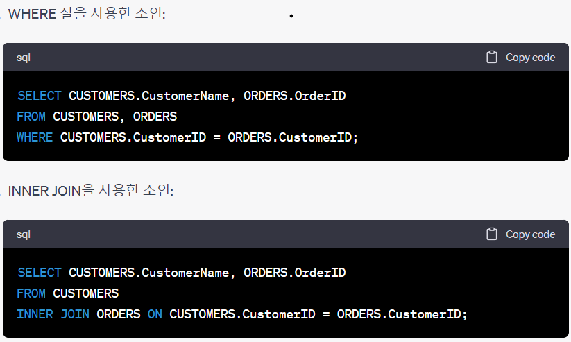

1. JOIN - 두 개 이상의 테이블들을 연결
  - JOIN은 관계형 데이터베이스의 가장 큰 장점이면서 대표적인 핵심 기능
  - 일반적인 경우 행들은 PK나 FK 값의 연관에 의해 JOIN이 성립된다
  - 어떤 경우에는 PK, FK 관계가 없어도 논리적인 값들의 연관만으로 JOIN 성립이 가능
  - 하나의 SQL 문장에서 여러 테이블을 조인해서 사용할 수도 있다
  - FROM절에 여러 테이블이 나열되더라도 SQL에서 데이터를 처리할 때는 두 개의 집합간에만 JOIN이 일어난다
  - FROM절에 A, B, C 3개의 테이블이 나열되었더라도 특정 2개의 테이블만 먼저 조인되고, 그 조인된 새로운 결과 집합과 남은 한 개의 테이블이 다음 차례로 조인

2. EQUI JOIN(등가 조인)
  - 두 테이블의 컬럼 값이 정확하게 일치하는 경우, 대부분 PK <-> FK 관계 기반
  - JOIN 조건은 WHERE절에 기술
  - SELECT 테이블1.컬럼명, 테이블2.컬럼명 
  FROM 테이블1, 테이블2 
  WHERE 테이블1.컬럼명 = 테이블2.컬럼명; -> WHERE 절에 JOIN 조건을 넣는다  
  SELECT 테이블1.컬럼명, 테이블2 컬럼명 
  FROM 테이블1 INNER JOIN 테이블2 ON 테이블1.컬럼명1 = 테이블2.컬럼명2 
  -> ON절에 JOIN 조건을 넣는다 
   
  - 조인 시 주의사항
    - 조건 절에 테이블에 대한 별명을 적용하여 SQL 문장을 작성했을 경우, WHERE 절과 SELECT 절에는 테이블명이 아닌 별명을 사용

3. Non EQUI JOIN(비등가 조인)
  - 두 테이블의 컬럼 값이 정확하게 일치하지 않는 경우
  - Non EQUI JOIN의 경우에는 '=' 연산자가 아닌 다른 (Between, >, >=, <, <= 등) 연산자들을 사용하여 JOIN을 수행
  - SELECT 테이블1.컬럼명, 테이블2.컬럼명 
  FROM 테이블1, 테이블2 
  WHERE 테이블1.컬럼명 BETWEEN 테이블2.컬럼명1 AND 테이블2.컬럼명2