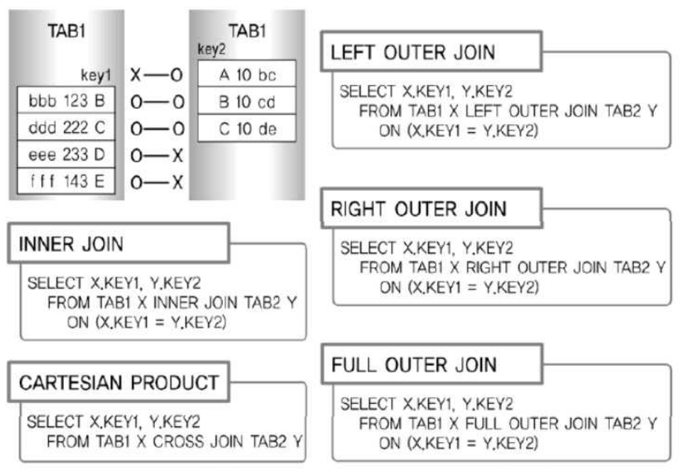

1. STANDARD SQL (표준 SQL) 개요
  - 표준 SQL의 기능
    - STANDARD JOIN 기능 추가 (CROSS, OUTER JOIN 등 새로운 FROM절 JOIN 기능들)
    - SCALAR SUBQUERY, TOP-N QUERY 등의 새로운 서브쿼리 기능들
    - ROLLUP, CUBE, GROUPING SETS 등의 새로운 리포팅 기능
    - WINDOW FUNCTION 같은 새로운 개념의 분석 기능들
  - 일반 집합 연산자
    - UNION 연산 -> UNION 기능 : 합집합
    - INTERSECTION 연산 -> INTERSECT 기능 : 교집합
    - DIFFERENCE 연산 -> EXCEPT, MINUS 기능 : 차집합
    - PRODUCT 연산 -> CROSS JOIN 기능 : 곱집합 (생길 수 있는 모든 데이터 조합)
  - 순수 관계 연산자
    - SELECT 연산 -> WHERE 절 : 조건에 맞는 행 조회
    - PROJECT 연산 -> SELECT 절 : 조건에 맞는 컬럼 조회
    - (NATURAL) JOIN 연산 -> 다양한 JOIN 기능 : 여러 조인 존재

2. FROM 절의 JOIN 형태
  - ANSI / ISO SQL에서 표시하는 FROM 절의 JOIN 형태
    - INNER JOIN / NATURAL JOIN / USING 조건절 / ON 조건절 / CROSS JOIN / OUTER JOIN
  - 기존 WHERE절 그대로 사용 가능
  - FROM절에서 JOIN 조건을 명시적으로 정의 가능

3. INNER JOIN - 내부 JOIN
  - JOIN 조건에서 동일한 값이 있는 행만 반환
  - DEFAULT 옵션이므로 생략이 가능하지만, CROSS JOIN / OUTER JOIN과는 같이 사용할 수 없음
  - USING 조건절이나 ON 조건절을 필수 사용
  - 중복 테이블의 경우 별개의 컬럼으로 표시

4. NATURAL JOIN
  - 두 테이블간 동일한 이름을 갖는 모든 컬럼에 대해 EQUI JOIN을 수행
  - USING, ON, WHERE에서 JOIN을 정의할 수 없다
  - JOIN에 사용된 컬럼은 같은 데이터 타입이어야 한다
  - 별명이나 접두사 붙일 수 없음

5. USING 조건절
  - FROM절에 USING 조건절을 이용해서 같은 이름을 가진 컬럼들 중에서 원하는 컬럼에 대해서만 선택적으로 EQUI JOIN을 할 수 있다
  - SQL Server에서는 지원하지 않음
  - JOIN 컬럼에 대해서는 별명이나 테이블이름과 같은 접두사를 붙일 수 없다
  - JOIN에 사용되는 컬럼은 1개만 표시한다

6. ON 조건절
  - 컬럼명이 달라도 JOIN 사용가능
  - WHERE 검색 조건은 충돌 없이 사용할 수 있다
  - ON 조건절에서 사용된 괄호는 옵션사항
  - 별명 및 테이블명과 같은 접두사를 반드시 사용

7. CROSS JOIN (= CARTESIAN PRODUCT / CROSS PRODUCT)
  - JOIN 조건이 없는 경우 생길 수 잇는 모든 데이터의 조합
  - JOIN 할 때 적절한 JOIN 조건 컬럼이 없는 경우 사용
  - 생길 수 있는 모든 데이터 조합을 출력
  - 결과는 양쪽 집합의 M*N 건의 데이터 조합 발생
  - SELECT ENAME, LOC FROM EMP CROSS JOIN DEPT; 
  위 쿼리문 사용할 경우 ENAME * LOC 값이 출력

8. OUTER JOIN
  - JOIN 조건에서 동일한 값이 없는 행도 출력
  - USING 조건절이나 ON 조건절을 필수로 사용
  - IN/ON 연산자 사용시 에러
  - 표시가 누락된 컬럼이 있을 경우 OUTER JOIN 오류 발생, FULL OUTER JOIN 미지원
  - FULL OUTER JOIN 미지원으로 인해 STANDARD JOIN 주로 사용
  - LEFT OUTER JOIN
    - 왼쪽 테이블의 모든 행을 포함하고, 오른쪽 테이블에서 일치하는 행이 있는 경우 해당 행을 포함
    - 왼쪽 테이블의 모든 행이 결과에 포함되므로, 오른쪽 테이블에서 일치하는 행이 없는 경우에는 NULL값이 포함된 결과가 반환
    - SELECT X.KEY1, Y.KEY2 FROM TAB1 X LEFT JOIN TAB2 Y ON (X.KEY = Y.KEY)
  - RIGHT OUTER JOIN
    - LEFT OUTER JOIN과 반대로 우측 테이블이 기준이 되어 결과 생성
  - FULL OUTER JOIN
    - 왼쪽 테이블과 오른쪽 모든 행을 포함
    - 두 테이블에서 일치하는 행이 없는 경우에도 각 테이블의 모든 행을 결과에 포함
    - SELECT X.KEY1, Y.KEY2 FROM TAB1 X FULL JOIN TAB2 Y ON (X.KEY = Y.KEY)

9. INNER JOIN vs OUTER JOIN vs CROSS JOIN 비교

  - 첫 번째, INNER JOIN의 결과는 다음과 같다. 양쪽 테이블에 모두 존재하는 키 값이 B-B, C-C 인 2건이 출력된다.
  - 두 번째, LEFT OUTER JOIN의 결과는 다음과 같다. TAB1을 기준으로 키 값 조합이 B-B, C-C, D-NULL, E-NULL 인 4건이 출력된다.
  - 세 번째, RIGHT OUTER JOIN의 결과는 다음과 같다. TAB2를 기준으로 키 값 조합이 NULL-A, B-B, C-C 인 3건이 출력된다.
  - 네 번째, FULL OUTER JOIN의 결과는 다음과 같다. 양쪽 테이블을 기준으로 키 값 조합이 NULL-A, B-B, C-C, D-NULL, E-NULL 인 5건이 출력된다.
  - 다섯 번째, CROSS JOIN의 결과는 다음과 같다. JOIN 가능한 모든 경우의 수를 표시하지만 단, OUTER JOIN은 제외한다.
   - 양쪽 테이블 TAB1과 TAB2의 데이터를 곱한 개수인 4 * 3 = 12건이 추출됨. 키 값 조합이 B-A, B-B, B-C, C-A, C-B, C-C, D-A, D-B, D-C, E-A, E-B, E-C 인 12건이 출력된다.
