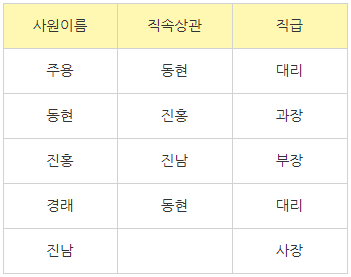
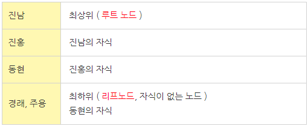
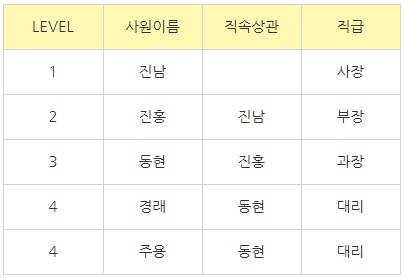
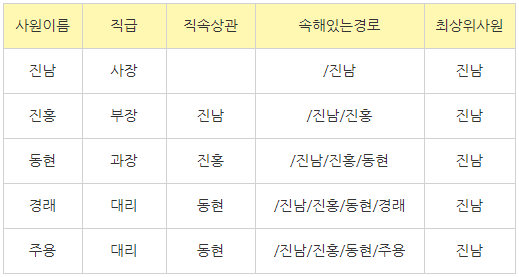

1. 계층형 질의
  - 계층형 데이터 : 동일 테이블에 계층적으로 상/하위 데이터가 포함된 데이터
  - 테이블에 계층형 데이터가 존재하는 경우 데이터를 조회하기 위해 사용
  - 엔터티를 순환관계 데이터 모델로 설계할 경우 계층형 데이터 발생
  - 계층형 질의 용어
    - 루트 노드(루트 데이터) : 가장 최상위의 데이터
    - 리프 노드(리프 데이터) : 가장 최하위의 데이터
    - 데이터를 전개하다 : 데이터를 찾아 나가다

2. 계층형 질의의 형태
  - SELECT ... 
    FROM ... 
    WHERE 조건 
    START WITH 조건 
    CONNECT BY [ NOCYCLE ] 조건 
    [ ORDER SIBLINGS BY 컬럼명1, 컬럼명2 ... ] ;
  - START WITH 절 : 데이터 전개가 시작될 데이터를 지정
  - CONNECT BY : 자식 데이터를 지정
  - PRIOR
    - CONNECT BY 절에서 사용
    - PRIOR 자식 = 부모 형태는 부모에서 자식 방향으로 데이터 전개(순방향)
    - PRIOR 부모 = 자식 형태는 자식에서 부모 방향으로 데이터 전개(역방향)
  - NOCYCLE : 데이터 전개 중 동일한 데이터가 나타나면 이것을 CYCLE이 발생했다고 한다. CYCLE이 발생한 데이터 이후 데이터를 전개하면 런타임 오류가 발생하는데, NOCYCLE을 추가하면 CYCLE이 발생한 이후의 데이터는 전개되지 않아 런타임 오류 방지
  - ORDER SIBLINGS BY절 : 동일한 LEVEL을 가진 노드(형제 노드) 사이에서 정렬을 수행
  - WHERE절 : 모든 데이터 전개를 수행 후 지정된 조건을 만족하는 데이터만 추출

- 계층형 질의에서 사용되는 가상 컬럼
  - LEVEL : 전개 과정에서 루트 데이터이면 1, 그 하위 데이터이면 2이다. 루트에서 리프로 내려갈수록 1씩 증가
  - CONNECT_BY_ISLEAF : 전개 과정에서 해당 데이터가 리프 데이터이면 1, 그렇지 않으면 0
  - CONNECT_BY_ISCYCLE : 전개 과정에서 해당 데이터가 조상으로서 존재하면(자식이 존재하면) 1, 그렇지 않으면 0이다. CYCLE 기능을 사용시에만 사용 가능

2. 계층형 질의 사용 예제 
  - 사원 테이블을 보면 '진남'이 관리하는 사원은 '진홍'이며,
   '진홍'은 '동현'을, '동현'은 '경래'와 '주용'을 관리하는 것을 알 수 있다.
   '경래'와 '주용'은 하위 사원이 존재하지 않으며 '진남'은 최상위 사원이기에 직속상관이 존재하지 않음을 알 수 있다. 
     
   이를 정리하면 아래의 표와 같은 계층형 구조가 된다 
     
   위 사원 테이블에 적용해 순방향 쿼리를 작성하면 
   SELECT LEVEL, 사원이름, 직속상관, 직급 
   FROM 사원 
   START WITH 직속상관 IS NULL 
   CONNECT BY PRIOR 사원이름 = 직속상관; 
   '사원이름'과 '직속상관' 컬럼은 계층형 데이터이다. 'START WITH 직속상관' 으로 '직속상관'컬럼이 부모컬럼임을 알 수 있고 IS NULL 조건을 통해 직속상관이 없는 사원부터 데이터 전개가 시작된다. 
   또한 'CONNECT BY PRIOR' 을 통해 직속상관(부모)에서 사원이름(자식) 방향(순방향)으로 데이터 전개가 시작된다.  
   해당 쿼리를 실행할 경우 아래와 같은 결과가 리턴된다 
     
   반대로 특정 사원으로부터 최상위 방향으로 찾아가는 역방향 쿼리문 
   SELECT LEVEL, 사원이름, 직속상관, 직급 
   FROM 사원 
   START WITH 사원이름 = '경래' 
   CONNECT BY PRIOR 직속상관 = 사원이름 ; 

  - Oracle에서는 계층형 질의를 사용할 경우 2가지 함수를 사용할 수 있다 
    - SYS_CONNECT_BY_PATH : 루트 데이터(최상위 데이터)로부터 현재 위치까지 전개할 데이터의 경로를 표시, SYS_CONNECT_BY_PATH(컬럼명, 경로분리기호)
    - CONNECT_BY_ROOT : 현재 전개할 데이터의 루트 데이터(최상위 데이터)를 표시, CONNECT_BY_ROOT(컬럼명)
    - Oracle 함수를 이용한 쿼리 
    SELECT 사원이름, 
    직급, 
    직속상관, 
    SYS_CONNECT_BY_PATH ( 사원이름, '/' ) 속해있는경로, 
    CONNECT_BY_ROOT ( 사원이름 ) 최상위사원 
    FROM 사원 
    START WITH 직속상관 IS NULL 
    CONNECT BY PRIOR 사원이름 = 직속상관 ; 
    위 쿼리는 직속상관이 없는 데이터부터 시작해 직속상관(부모)에서 사원이름(자식)쪽으로 데이터전개하는 순방향 쿼리이다. 해당 쿼리의 결과값은 다음과 같음 
      
  - SQL Server 계층형 질의 : CTE(Common Table Expression)로 재귀 호출하여 상위부터 하위 방향으로 전개
    - WITH 테이블명_ANCHOR AS ( 
      SELECT 하위컬럼명, 컬럼명, 상위컬럼명, 0 AS LEVEL 
      FROM 테이블명 
      WHERE 상위컬럼명 IS NULL -> 재귀 호출의 시작점 
      UNION ALL 
      FROM 테이블명_ANCHOR A, 테이블명 R 
      WHERE A.하위컬럼 = R.상위컬럼 
    )
  - 셀프 조인 : 하나의 테이블에 가상으로 1, 2라는 별칭을 부여하여 2개의 테이블인 것처럼 간주한 뒤 JOIN 하는 것. 컬럼 내에 섞여있는 여러 레코드들을 다른 컬럼을 통해서 관계를 알 수 있게 조회하는 것