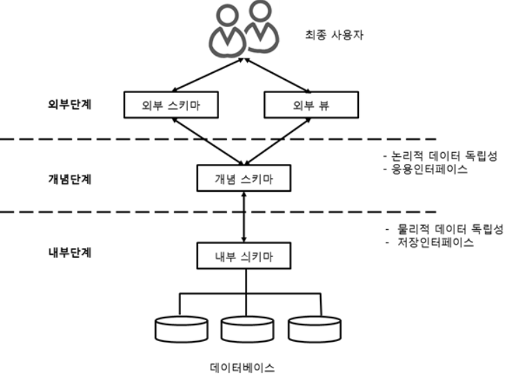

데이터 모델의 이해
1. 모델링
  - 다양한 현상을 추상화, 단순화 하여 일정한 표기법에 의해 표현하는 것
  - 모델이란 현실 세계의 추상화 된 반영

2. 모델링의 특징
  - 추상화 : 다양한 현상을 일정한 양식인 표기법에 의해 표현
  - 단순화 : 제한된 표기법이나 언어로 표현하여 쉽게 이해할 수 있게 한다.
  - 명확화 : 애매모호함을 제거하여 이해가 쉽게 표현

3. 모델링의 관점
  - 데이터 관점(what) : 업무와 데이터 사이에 관련이 있는지 또는 데이터간 관계를 위해 모델링
  - 프로세스 관점(how) : 업무가 실제로 하고 있는 일, 해야 하는 일을 모델링
  - 데이터와 프로세스의 상관 관점 (interaction) : 데이터에 대한 업무 처리 방식의 영향을 모델링

  * 데이터 모델링의 중요성과 유의점
  - 중요성 : 
    1. 파급효과 : 시스템 구축이 완성되어 가면서 테스트 하는 단계에서 불가피하게 데이터 모델의 변경이 필요할 경우
    전체 시스템 구축 프로젝트에서 큰 위험요소가 될 수 있으므로 어떤 설계 과정보다 데이터 설계가 중요
    2. 간결한 표현 : 구축 할 시스템의 정보 요구사항과 한계를 가장 명확하고 간결하게 표현할 수 있는 도구. 건축 도면과 같음
    3. 데이터 품질 유지 : 중복 데이터 미정의, 비즈니스 정의 불충분, 동일한 성격의 데이터를 통합하지 않고 분리함으로써
    나타나는 데이터 불일치 등 데이터 구조의 문제로 인한 품질 문제는 수정하기 어려운 경우가 많음.
  - 유의점
    1. 중복 : 여러 장소에 같은 정보 저장 X
    2. 비유연성 : 데이터의 정의를 데이터 사용 프로세스와 분리
    3. 비일관성 : 모델링 할 때 데이터 간 상호 연관 관계 명확히 정의

4. 데이터 모델링의 3단계
  - 개념적 모델링 (계획/분석) : ERD 도출, 조직과 사용자의 데이터 요구사항을 찾고 분석
  - 논리적 모델링 (분석) : 테이블 도출, (key, 속성 관계)를 표현, 재사용성, 정규화 수행
  - 물리적 모델링 (설계) : DB구축, 실질적으로 테이블과 컬럼 등 DB를 구현하는 단계

5. 데이터 독립성
  - 종속성에 대비되는 말, DBMS의 궁극적인 목표
  - 데이터의 구조가 변경되어도 응용 프로그램이 변경 될 필요가 없음
  - 논리적 독립성 + 물리적 독립성으로 실현 됨
  - 필요성 : 유지보수 비용, 데이터 중복성, 데이터 복잡도는 증가함으로 인한 요구사항 대응을 저하하기 위함. 
  

   - 논리적 독립성 : 응용 프로그램과 데이터 베이스를 독립시킴으로써, 데이터의 논리적 구조를 변경시키더라도 응용 프로그램은 변경되지 않음. 
  ex) 각각 업무마다 업무에 관련 된 자료가 들어간 파일이 있다. 파일마다 중복된 값이 존재할 수도 있다. 이 중 상품 코드의 값이 변경될 경우 수정 전의 상품 코드 값이 들어간 파일들을 모두 수정해야 하는 번거로움이 발생하는 문제를 해결하기 위해 사용.

   - 물리적 독립성 : 응용 프로그램과 보조기억장치 같은 물리적 장치를 독립시킴으로써, DB시스템의 성능 향상을 위해 새로운 디스크를 도입하더라도 프로그램에는 영향을 주지 않고 데이터의 물리적 구조만을 변경하는 것. 
   ex) HDD와 같은 물리장치를 업그레이드 하더라도 프로그램에는 지장이 없도록 하는 것  
 

- 스키마 3계층
  - 외부 스키마 (= 서브 스키마)
    - 사용자가 보는 관점(사용자에 따라 다름, 여러 개가 존재한다 = 사용자마다 보고 싶은 값이 다르기 때문)
  - 개념 스키마 (= 스키마 = 전체적인 뷰, 범기관적, 총괄적 입장)
    - DB 전체적인 논리적 구조(전체 정보가 들어가 있는 것)
    - 개체간의 관계와 제약 조건을 나타내고 데이터 베이스의 접근 권한, 보안 및 무결성 규칙을 명세화 한다.
  - 내부 스키마(실체 Data를 저장)
    - DB 전체적인 물리적 구조
    - 기업이나 조직등에 있는 데이터베이스 관리자가 직접 관리 함
- 사상(Mapping)
  - 상호 독립적인 개념을 연결시켜주는 다리
  - 논리적 사상 : 외부 화면 및 사용자 인터페이스 스키마 구조는 개념 스키마와 연결
  - 물리적 사상 : 개념 스키마 구조와 물리적 저장된 구조(테이블 스페이스)와 연결

6. 데이터 모델링 3가지 요소 (엔티티, 속성, 관계)
  - 업무가 관여하는 어떤 것(Thing)
  - 어떤 것이 가지는 성격(Attribute)
  - 업무가 관여하는 것들과의 관계(RealationShip)

  - 단수와 복수(집합)의 명명
    - 데이터 모델링에서는 이 세 가지 개념에 대해서 단수와 복수의 개념을 분명하게 하고 있고, 실제로 모델링을 할 때 많이 활용되는 용어.
     

7. ERD(Entity RealationShip Diagram)
   - 데이터 모델 표기법 : 엔티티를 사각형, 관계를 마름모, 속성을 타원형으로 표현

8. ERD 표기법을 이용하여 모델링 하는 방법
  1. 엔티티를 그린 후 적절하게 배치
  2. 엔티티 간 관계 설정
    - 식별자 관계를 우선으로 설정(식별자 관계 : 부모로부터 상속 받은 FK가 자식의 PK의 일부가 되는 관계)
    - 가급적 Cycle 관계도 발생하지 않아야 한다.
  3. 관계명 기술 (양 방향)
    - 현재형 사용, 지나치게 포괄적인 단어는 지양
    - 실제 프로젝트에서는 크게 고려할 이유 없음
  4. 관계차수, 관계의 참여도, 선택성 표시

9. 좋은 모델링의 요건
  - 완전성 : 업무에서 필요로 하는 모든 데이터가 데이터 모델에 정의돼야 한다.
  - 중복배제 : 동일한 사실은 반드시 한번만 기록
  - 업무규칙 : 업무규칙이 데이터 모델에 표현돼야 한다.
  - 데이터 재사용 : 회사 전체 관점에서 공통 데이터 도출, 전 영역에서 사용할 수 있도록 설계
  - 통합성 : 동일한 데이터는 조직의 전체에서 한번만 정의되고 이를 참조, 활용